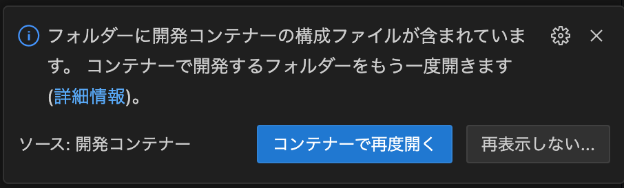

# セキュリティ・ミニキャンプ in 石川 2024 演習用リポジトリ

[公式HP](https://www.security-camp.or.jp/minicamp/ishikawa2024.html)

## How to use

以下のいずれかの方法で演習用ターミナルに入ります。いずれの方法でも、`/workspace`ディレクトリに入れていることを確認してください。

注意点として、予めローカルのポート番号8080-8084の5つをを開けておいてください。

### VSCode Dev Containersを使う場合(おすすめ)

1. VSCodeでこのリポジトリを開く
2. 右下の`コンテナーで再度開く`をクリック 
3. ターミナルが表示されていない場合は新しいターミナルを開いてください
   1. 新しいターミナルは「Ctrl+Shift+`` ` ``」で開けます

### VSCodeを使わない場合

```sh
docker-compose up -d
docker-compose exec app /bin/sh
```

## Webアプリケーションの起動方法

1. hands-onディレクトリから問題名を確認します。
2. 以下のコマンドで起動します。

```sh
yarn install
yarn <ここに問題名を入力>
# 例えば、isAdminのサーバを起動する場合は
yarn isAdmin

# または、すべてのサーバを同時に起動する場合は以下のコマンドを実行します。
# CTF用の問題が追加されるまではError: Cannot find moduleが出ますが、正常です。
# CTFが始まったらCtrl+Cで一度終了 → git pullで最新のリポジトリを取得 → 再度yarn allを実行してください。
yarn all
```

起動すると、「`Server is running on http://localhost:8003`」のようなメッセージが表示されます。ブラウザで`http://localhost:8003`にアクセスしてください。注意点として、問題によってポートが異なります。起動した時の出力を確認してください。

講義の最後に実施するCTFでも本リポジトリを使用します。
